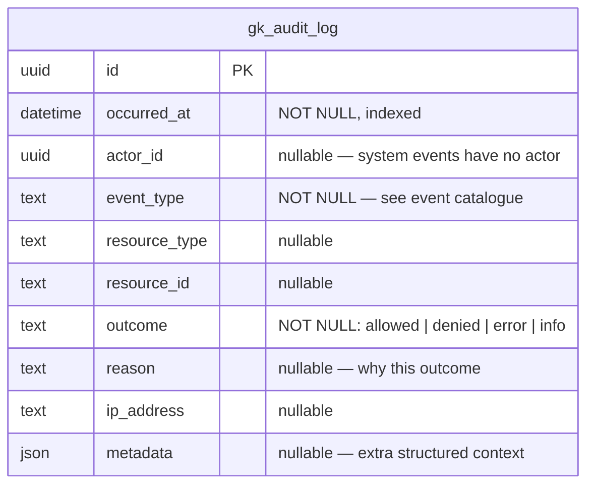
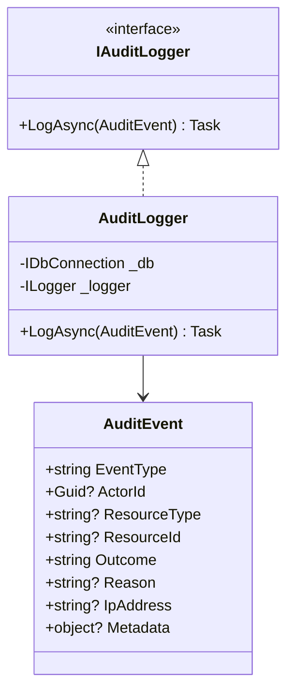

# Spec: GK-AUDIT — Audit Logging

> Spec IDs: `[GK-AUDIT-*]`  
> Parent spec: `gatekeeper-spec.md`

---

## [GK-AUDIT] Overview

Every significant authentication and authorization event is recorded in `gk_audit_log`. The audit log is append-only, write-optimized, and never exposes PII. It is the authoritative record for security investigations, compliance review, and anomaly detection.

---

## [GK-AUDIT-SCHEMA] Schema



Indexes:
- `(actor_id, occurred_at)` — user activity timeline
- `(event_type, occurred_at)` — event type queries
- `(occurred_at)` — time-range queries

---

## [GK-AUDIT-EVENTS] Event Catalogue

| event_type | outcome | Triggered by | metadata fields |
|---|---|---|---|
| `auth.register.begin` | `info` | POST /auth/register/begin | `{email_hash}` |
| `auth.register.success` | `info` | POST /auth/register/complete | `{credential_id, device_name}` |
| `auth.register.failure` | `error` | POST /auth/register/complete | `{reason}` |
| `auth.login.begin` | `info` | POST /auth/login/begin | — |
| `auth.login.success` | `info` | POST /auth/login/complete | `{credential_id}` |
| `auth.login.failure` | `denied` | POST /auth/login/complete | `{reason, failed_count}` |
| `auth.logout` | `info` | POST /auth/logout | — |
| `auth.logout.all` | `info` | POST /auth/logout-all | `{new_token_version}` |
| `auth.session.expired` | `info` | Token validation | — |
| `auth.token.revoked` | `denied` | Token validation | — |
| `auth.user.inactive` | `denied` | Token validation | — |
| `auth.token.version_mismatch` | `denied` | Token validation | `{expected_ver, actual_ver}` |
| `security.credential.clone` | `denied` | Sign count validation | `{credential_id, stored_count, received_count}` |
| `security.account.locked` | `info` | 5th failed login | `{locked_until}` |
| `security.rate_limit.rejected` | `denied` | Rate limit middleware | `{bucket_key, count}` |
| `authz.permission.allowed` | `allowed` | /authz/check | `{permission, resource_type, resource_id, source}` |
| `authz.permission.denied` | `denied` | /authz/check | `{permission, resource_type, resource_id}` |
| `admin.user.deactivated` | `info` | PATCH /admin/users/{id} | `{target_user_id}` |
| `admin.role.assigned` | `info` | POST /admin/users/{id}/roles | `{target_user_id, role_id}` |
| `admin.grant.created` | `info` | POST /admin/grants | `{target_user_id, resource_type, resource_id}` |

---

## [GK-AUDIT-PII] PII Rules

- **NEVER** log `email`, `display_name`, or any user-readable identifier.
- `actor_id` is a UUID. Cross-reference to user identity requires a separate privileged lookup.
- `email_hash` in metadata is `SHA-256(lowercase(email))` — non-reversible, only for deduplication.
- `ip_address` is stored as-is (operational necessity for security investigations).

---

## [GK-AUDIT-WRITER] AuditLogger



- Write is fire-and-forget: `_ = _auditLogger.LogAsync(evt)` — never `await` in hot paths.
- Failures are caught and logged at `Warning` level. They do not propagate to callers.
- Batch writes are not used — each event is written immediately for real-time queryability.

---

## [GK-AUDIT-ENDPOINT] Admin Query Endpoint

**GET /admin/audit**

Requires `admin:audit:read` permission.

Query parameters:

| Param | Type | Description |
|---|---|---|
| `eventType` | string | Filter by event_type (prefix match) |
| `actorId` | uuid | Filter by actor |
| `outcome` | string | `allowed`, `denied`, `error`, `info` |
| `from` | ISO8601 | Start datetime (inclusive) |
| `to` | ISO8601 | End datetime (exclusive) |
| `limit` | int | Max results (default 50, max 500) |
| `offset` | int | Pagination offset |

Response:
```json
{
  "total": 1234,
  "items": [
    {
      "id": "uuid",
      "occurredAt": "2026-05-02T10:00:00Z",
      "actorId": "uuid",
      "eventType": "auth.login.success",
      "outcome": "info",
      "ipAddress": "203.0.113.42",
      "metadata": {}
    }
  ]
}
```
