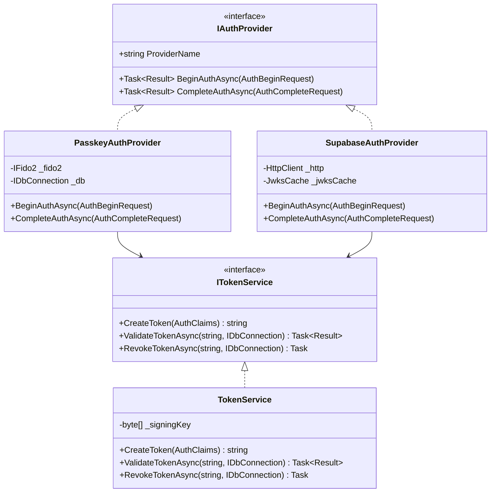
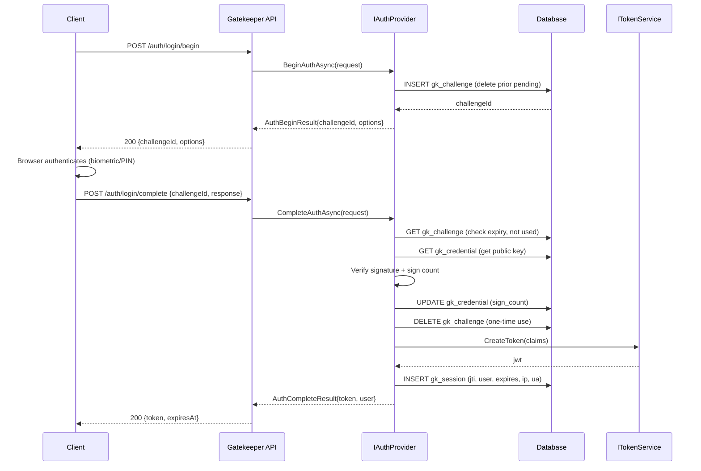
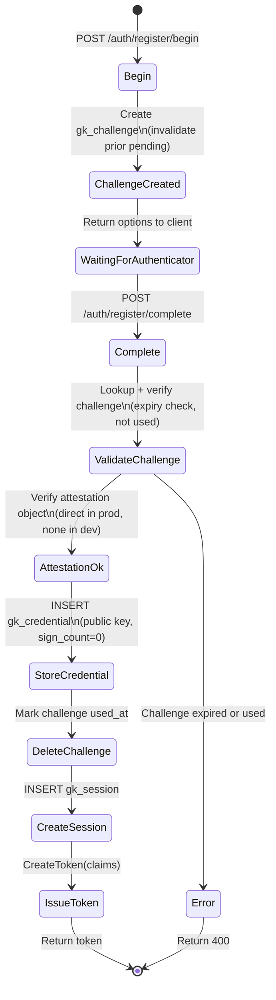
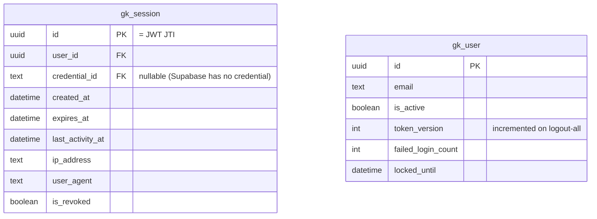

# Spec: GK-AUTH — Authentication

> Spec IDs: `[GK-AUTH-*]`  
> Parent spec: `gatekeeper-spec.md`

---

## [GK-AUTH] Overview

Gatekeeper supports multiple authentication providers through a shared `IAuthProvider` abstraction. All providers produce the same internal JWT token. The authentication layer is fully separated from the authorization layer — `IAuthProvider` only proves identity; it never makes access decisions.

---

## [GK-AUTH-ARCH] Provider Architecture



---

## [GK-AUTH-FLOW] Authentication Flow



---

## [GK-AUTH-PASSKEY] Passkey Provider

### [GK-AUTH-PASSKEY-REG] Registration Flow



### [GK-AUTH-PASSKEY-SIGNCOUNT] Sign Count Validation

On every `/auth/login/complete`:

1. Read `gk_credential.sign_count` (stored count)
2. Receive `newSignCount` from authenticator response
3. Rules:
   - If `newSignCount == 0` AND `storedSignCount == 0`: pass (authenticator doesn't support counter)
   - If `newSignCount > storedSignCount`: pass — update `sign_count = newSignCount`
   - If `newSignCount <= storedSignCount` AND `newSignCount != 0`: **credential cloned** — revoke, write audit event `credential.clone_detected`, return 401

### [GK-AUTH-PASSKEY-CHALLENGE] Challenge Lifecycle

- TTL: **120 seconds** (reduced from 300s)
- On new `/begin` call: atomically delete any existing `gk_challenge` for same `(user_id, type)` before inserting new one
- On `/complete`: delete row immediately (not soft-delete) — atomic check-and-delete prevents replay
- `used_at` column: set on deletion for audit purposes (row kept 24h then purged)

### [GK-AUTH-PASSKEY-ATTEST] Attestation

| Environment | `ATTESTATION_PREFERENCE` | Behaviour |
|---|---|---|
| Dev / Test | `none` | Any attestation accepted |
| Staging | `indirect` | Attestation collected but not verified |
| Production | `direct` | Attestation chain verified against FIDO MDS3 |

Config via env var `ATTESTATION_PREFERENCE`. The default must fail-safe to `none` only when the signing key is the all-zeros dev key.

---

## [GK-AUTH-SUPABASE] Supabase Provider

### [GK-AUTH-SUPABASE-FLOW] Token Exchange Flow

```mermaid
sequenceDiagram
    participant C as Client
    participant G as Gatekeeper API
    participant S as SupabaseAuthProvider
    participant JWKS as Supabase JWKS Endpoint
    participant T as ITokenService
    participant DB as Database

    C->>G: POST /auth/supabase/exchange\n{supabaseToken}
    G->>S: CompleteAuthAsync({token: supabaseToken})
    S->>S: Decode JWT header (extract kid)
    S->>JWKS: GET /.well-known/jwks.json\n(cached 1h; refresh on kid miss)
    JWKS-->>S: {keys: [...]}
    S->>S: Verify signature (RS256 or EdDSA only)\nValidate: exp, aud="authenticated",\niss=supabaseUrl
    S->>DB: Upsert gk_user (sub → user_id)
    S->>T: CreateToken(claims from Supabase sub)
    T-->>S: internal jwt
    S->>DB: INSERT gk_session
    S-->>G: AuthCompleteResult{internalToken}
    G-->>C: 200 {token, expiresAt}
```

### [GK-AUTH-SUPABASE-ALGO] Algorithm Enforcement

- Accepted: `RS256`, `EdDSA`
- Rejected: `HS256`, `HS384`, `HS512`, `none`
- Algorithm enforcement is server-side — the `alg` header field from the JWT is verified against the expected algorithm, never trusted blindly.

---

## [GK-AUTH-SESSION] Session Management



**Rules:**

- `gk_session` row MUST be written on every successful login/register.
- `ValidateTokenAsync` MUST verify both `is_revoked = false` AND `gk_user.is_active = true`.
- `ValidateTokenAsync` MUST verify JWT `ver` claim equals `gk_user.token_version`.
- `POST /auth/logout` sets `is_revoked = true` on the session identified by JTI.
- `POST /auth/logout-all` increments `gk_user.token_version`, invalidating all outstanding tokens instantly.

---

## [GK-AUTH-JWT] JWT Claims

| Claim | Value | Notes |
|---|---|---|
| `sub` | user UUID | |
| `name` | display_name | |
| `email` | user email | |
| `roles` | string[] | |
| `jti` | UUID v4 | = session id |
| `iat` | unix ts | |
| `exp` | unix ts | 15 minutes from now |
| `aud` | service identifier | e.g. `"gatekeeper"` |
| `iss` | issuer URL | from config |
| `ver` | int | = `gk_user.token_version` |

**Signing algorithm:** configurable via `AUTH_SIGNING_ALGORITHM`.  
Default: `RS256` (production). Dev/test: `HS256` with 32-byte key.  
`alg` header in incoming JWT is never trusted — algorithm enforced server-side.

---

## [GK-AUTH-LOCK] Account Lockout

- After **5 consecutive** failed `/auth/login/complete` for the same account:
  - Set `gk_user.locked_until = now + 15 minutes`
  - Reset `failed_login_count = 0`
  - Write audit event `account.locked`
- On each `/auth/login/begin`: if `locked_until > now`, return `429` with `Retry-After` header.
- On successful login: reset `failed_login_count = 0`.

---

## [GK-AUTH-ENDPOINTS] Endpoint Summary

| Method | Path | Auth | Description |
|---|---|---|---|
| POST | `/auth/register/begin` | None | Start passkey registration |
| POST | `/auth/register/complete` | None | Complete passkey registration |
| POST | `/auth/login/begin` | None | Start passkey authentication |
| POST | `/auth/login/complete` | None | Complete passkey authentication |
| POST | `/auth/supabase/exchange` | None | Exchange Supabase token for internal token |
| GET | `/auth/session` | Bearer | Get current session info |
| POST | `/auth/logout` | Bearer | Revoke current session |
| POST | `/auth/logout-all` | Bearer | Revoke all sessions (increment token version) |
