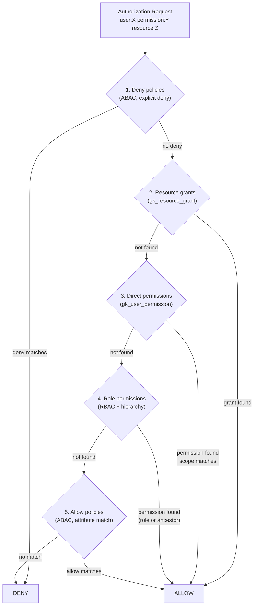
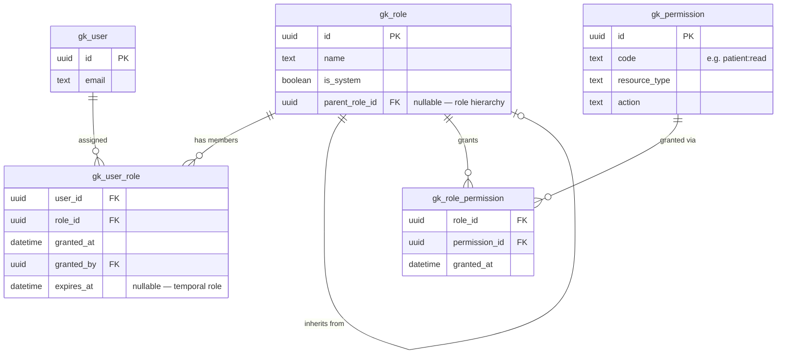
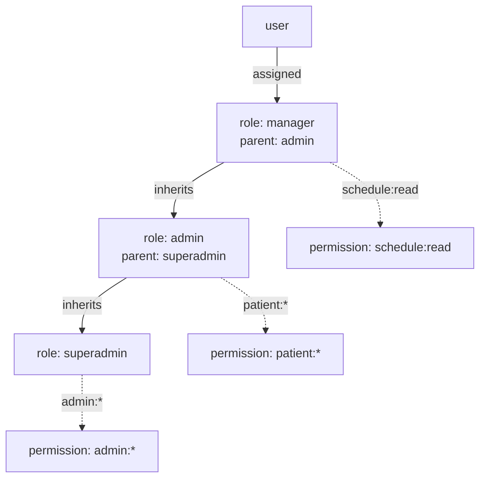
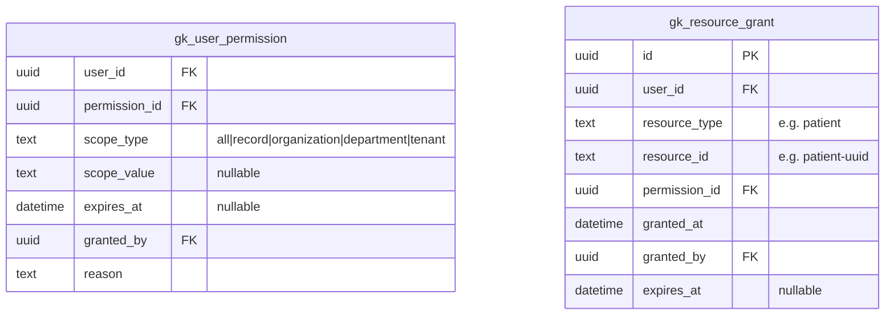
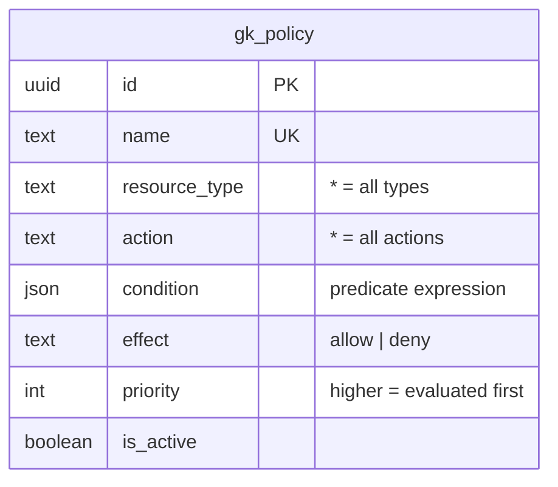
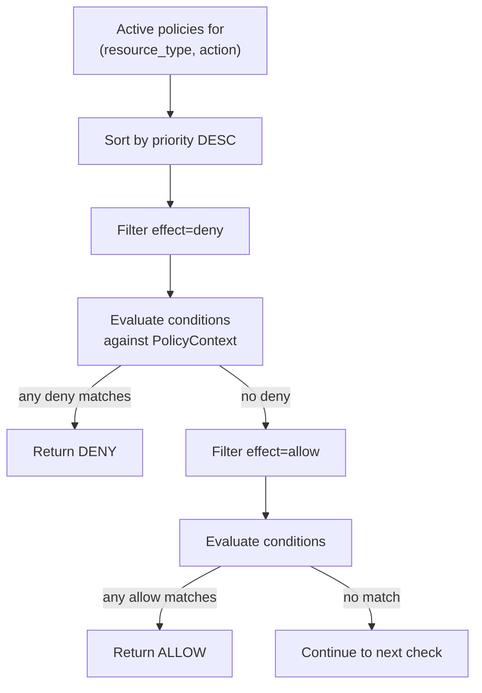

# Spec: GK-AUTHZ — Authorization

> Spec IDs: `[GK-AUTHZ-*]`  
> Parent spec: `gatekeeper-spec.md`

---

## [GK-AUTHZ] Overview

Authorization determines whether an authenticated identity may perform an action on a resource. Gatekeeper implements a hybrid RBAC + ABAC model with record-level granularity. Authorization is entirely separated from authentication — the authz engine consumes an already-validated `AuthClaims` record.

---

## [GK-AUTHZ-MODEL] Authorization Model



---

## [GK-AUTHZ-RBAC] Role-Based Access Control

### [GK-AUTHZ-RBAC-SCHEMA] Data Model



### [GK-AUTHZ-RBAC-HIERARCHY] Role Hierarchy

`gk_role.parent_role_id` enables permission inheritance. Resolution algorithm:

1. Load direct roles for user (filtered: `expires_at IS NULL OR expires_at > now`)
2. For each role, walk `parent_role_id` chain until `NULL` (cycle guard: max depth 10)
3. Collect all role IDs in the chain
4. Load all permissions granted to any role in the chain
5. Apply wildcard matching against the requested permission



User inherits all three permissions.

### [GK-AUTHZ-RBAC-WILDCARD] Wildcard Matching

Permission codes follow `resource:action` format. Wildcard `*` matches any segment suffix.

| Stored permission | Requested permission | Match? |
|---|---|---|
| `admin:*` | `admin:users` | ✓ |
| `admin:*` | `admin:users:create` | ✓ |
| `patient:read` | `patient:read` | ✓ |
| `patient:*` | `patient:read` | ✓ |
| `patient:read` | `patient:write` | ✗ |
| `*` | anything | ✓ |

---

## [GK-AUTHZ-GRANTS] Direct and Resource Grants

### [GK-AUTHZ-GRANTS-DIRECT] Direct User Permissions

`gk_user_permission` assigns a permission to a user directly (bypassing roles), with an optional scope:

| scope_type | scope_value | Meaning |
|---|---|---|
| `all` | — | User has this permission on all resources of this type |
| `record` | resource UUID | User has this permission on one specific record |
| `organization` | org UUID | User has this permission on all records in this org |
| `department` | dept code | User has this permission on all records in this dept |
| `tenant` | tenant UUID | User has this permission within this tenant |

### [GK-AUTHZ-GRANTS-RESOURCE] Record-Level Grants

`gk_resource_grant` is the highest-specificity grant: a single user, a single resource, a single permission.



---

## [GK-AUTHZ-ABAC] Attribute-Based Access Control

### [GK-AUTHZ-ABAC-SCHEMA] Policy Schema



### [GK-AUTHZ-ABAC-CONDITIONS] Condition Operators

Conditions are JSON predicates evaluated against a `PolicyContext`:

```json
{
  "user": { "id": "...", "roles": [...], "department": "..." },
  "resource": { "type": "...", "id": "...", "owner_id": "...", "status": "..." },
  "env": { "hour": 14, "day_of_week": 2, "ip": "..." }
}
```

| Operator | Example | Meaning |
|---|---|---|
| `$eq` | `{"user.department": {"$eq": "finance"}}` | Equality |
| `$neq` | `{"resource.status": {"$neq": "archived"}}` | Not equal |
| `$in` | `{"user.roles": {"$in": ["admin","manager"]}}` | Value in list |
| `$nin` | `{"user.roles": {"$nin": ["blocked"]}}` | Value not in list |
| `$gt` / `$lt` | `{"env.hour": {"$gt": 9, "$lt": 17}}` | Numeric comparison |
| `$prefix` | `{"resource.id": {"$prefix": "dept-42-"}}` | String prefix |
| `$contains` | `{"resource.tags": {"$contains": "pii"}}` | Array/string contains |
| `$and` | `{"$and": [...]}` | All conditions must match |
| `$or` | `{"$or": [...]}` | Any condition must match |
| `$ref` | `{"user.id": {"$ref": "resource.owner_id"}}` | Cross-context field comparison |

### [GK-AUTHZ-ABAC-EVAL] Evaluation Order



Deny always overrides allow. A higher-priority deny cannot be overridden by a lower-priority allow.

---

## [GK-AUTHZ-ENDPOINTS] Authorization Endpoints

### GET /authz/check

Check a single permission.

**Query params:** `permission`, `resourceType` (optional), `resourceId` (optional)

```json
Response:
{
  "allowed": true,
  "reason": "role:admin grants patient:read",
  "source": "rbac"
}
```

`source` values: `"resource-grant"`, `"direct-permission"`, `"rbac"`, `"abac-allow"`, `"abac-deny"`, `"default-deny"`

### POST /authz/evaluate

Batch check. Maximum 50 checks per request.

```json
Request:
{
  "checks": [
    { "permission": "patient:read", "resourceType": "patient", "resourceId": "uuid" }
  ]
}

Response:
{
  "results": [
    { "permission": "patient:read", "resourceId": "uuid", "allowed": true, "reason": "..." }
  ]
}
```

### GET /authz/permissions

List all effective permissions for the current user with source and scope.

```json
Response:
{
  "permissions": [
    { "code": "patient:read", "source": "role:clinician", "scopeType": "all" },
    { "code": "patient:write", "source": "direct-grant", "scopeType": "record", "scopeValue": "patient-123" }
  ]
}
```

---

## [GK-AUTHZ-AUDIT] Authorization Audit

Every `/authz/check` call writes a `gk_audit_log` row:

| Field | Value |
|---|---|
| `event_type` | `permission.allowed` or `permission.denied` |
| `actor_id` | user UUID (never email) |
| `resource_type` | requested resource type |
| `resource_id` | requested resource id |
| `outcome` | `"allowed"` or `"denied"` |
| `reason` | source string from evaluation |

Audit writes are fire-and-forget (non-blocking). Failures are logged but do not fail the check.
