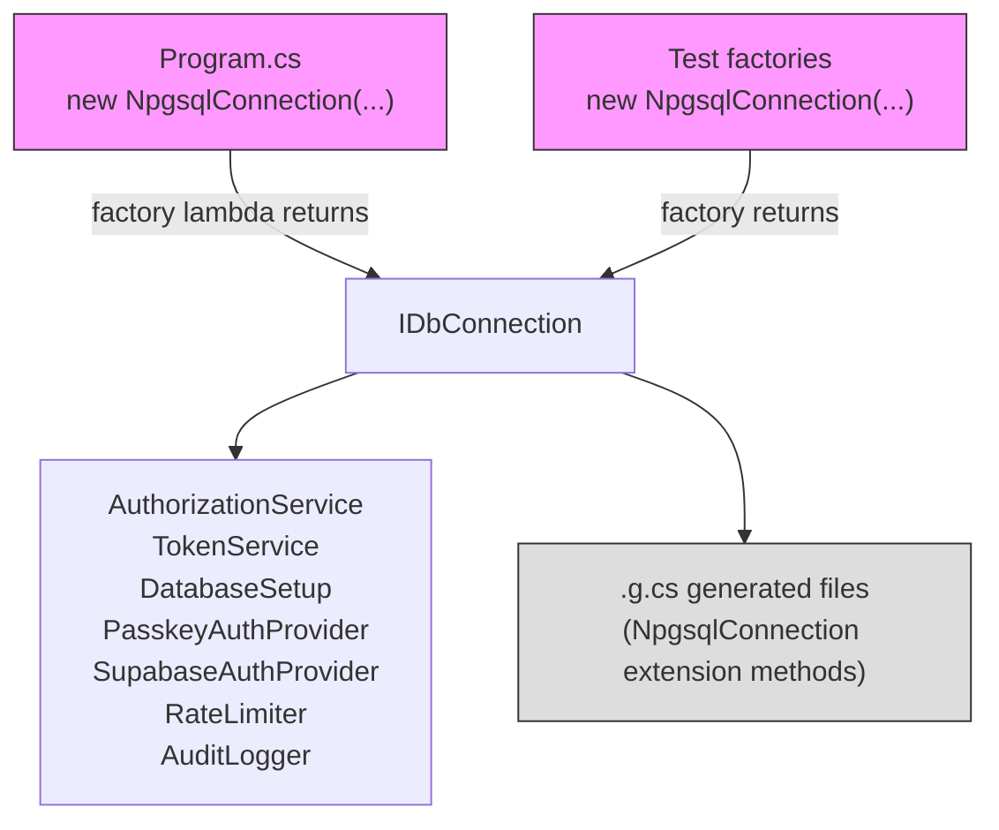
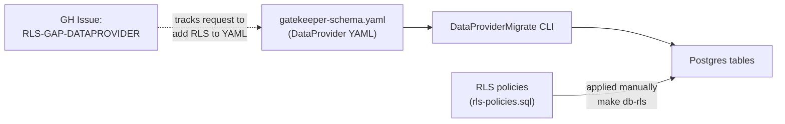
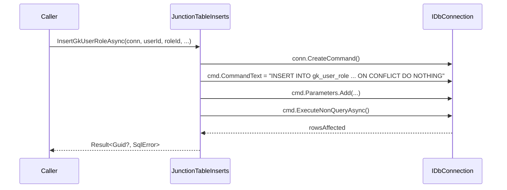

# Spec: GK-DB — Database Independence

> Spec IDs: `[GK-DB-*]`  
> Parent spec: `gatekeeper-spec.md`

---

## [GK-DB] Overview

All Gatekeeper application code above the DataProvider-generated layer must be database-agnostic. `NpgsqlConnection` is Postgres-specific and must not appear in any service, helper, test helper, or library except as the concrete type instantiated in `Program.cs` and test factory setup. Every database operation uses `IDbConnection`.

All hand-written SQL files are replaced with LQL where LQL supports the required operations. Where LQL has gaps, the SQL files are kept with gap-tracking comments and corresponding GitHub issues are logged against the DataProvider repository.

---

## [GK-DB-CONN] Connection Abstraction Rule



Pink nodes are the **only** places `NpgsqlConnection` is permitted.  
Gray = generated code (excluded from the rule).

Verification:
```bash
grep -r "NpgsqlConnection" --include="*.cs" . \
  | grep -v "\.g\.cs" \
  | grep -v "Program\.cs" \
  | grep -v "Factory\.cs"
# Must produce zero output
```

---

## [GK-DB-LQL] SQL to LQL Migration

### [GK-DB-LQL-MIGRATED] Fully Migrated (18 queries)

All migrated to `Gatekeeper/Gatekeeper.Api/Lql/*.lql`:

| SQL File (deleted) | LQL File | Key LQL operations |
|---|---|---|
| `GetUserByEmail.sql` | `GetUserByEmail.lql` | `filter(Email = @email AND IsActive = true)` |
| `GetUserById.sql` | `GetUserById.lql` | `filter(Id = @id)` |
| `GetAllUsers.sql` | `GetAllUsers.lql` | `order_by(DisplayName)` |
| `GetUserCredentials.sql` | `GetUserCredentials.lql` | `filter(UserId = @userId)` |
| `GetCredentialById.sql` | `GetCredentialById.lql` | `join(gk_user)` + `filter(IsActive)` |
| `GetCredentialsByUserId.sql` | `GetCredentialsByUserId.lql` | `filter(UserId = @userId)` |
| `GetSessionById.sql` | `GetSessionById.lql` | `join(gk_user)` + `filter(IsRevoked, ExpiresAt, IsActive)` |
| `GetSessionForRevoke.sql` | `GetSessionForRevoke.lql` | `filter(Id = @jti)` |
| `GetSessionRevoked.sql` | `GetSessionRevoked.lql` | `filter(Id = @jti)` + `select(IsRevoked)` |
| `GetChallengeById.sql` | `GetChallengeById.lql` | `filter(Id = @id AND ExpiresAt > @now)` |
| `GetUserRoles.sql` | `GetUserRoles.lql` | `join(gk_role)` + `filter(UserId, expires_at)` |
| `GetAllRoles.sql` | `GetAllRoles.lql` | `order_by(Name)` |
| `GetRolePermissions.sql` | `GetRolePermissions.lql` | `join(gk_permission via gk_role_permission)` |
| `GetPermissionByCode.sql` | `GetPermissionByCode.lql` | `filter(Code = @code)` |
| `GetAllPermissions.sql` | `GetAllPermissions.lql` | `order_by(ResourceType, Action)` |
| `CheckResourceGrant.sql` | `CheckResourceGrant.lql` | `join(gk_permission)` + `filter(expiry)` |
| `CountSystemRoles.sql` | `CountSystemRoles.lql` | `filter(IsSystem = true)` |
| `GetActivePolicies.sql` | `GetActivePolicies.lql` | `filter(IsActive, ResourceType, Action)` + `order_by(Priority desc)` |

### [GK-DB-LQL-REPLACED] Replaced by Generated CRUD (1 query)

| SQL File (deleted) | Replacement |
|---|---|
| `RevokeSession.sql` | `generateUpdate: true` on `gk_session` in `DataProvider.json`. Callers use generated `UpdateGkSessionAsync()`. |

### [GK-DB-LQL-GAPS] LQL Gap Files (2 queries kept as SQL)

These files remain in `Sql/` with gap-tracking comments. GitHub issues are logged on the DataProvider repo.

| File | Gap ID | SQL Feature | GH Issue |
|---|---|---|---|
| `GetUserPermissions.sql` | `[LQL-GAP-UNION]` | `UNION ALL` of two subqueries | TBD |
| `CheckPermission.sql` | `[LQL-GAP-EXISTS]` | Correlated `EXISTS` subqueries | TBD |

Each gap file starts with:
```sql
-- [LQL-GAP-UNION] UNION ALL not yet supported in LQL.
-- Track: https://github.com/MelbourneDeveloper/DataProvider/issues/<N>
-- This file must be replaced with LQL once the gap is resolved.
```

---

## [GK-DB-RLS] Row-Level Security Gap



Until DataProvider YAML supports RLS declarations, policies are defined in `docs/specs/rls-policies.sql` and applied via `make db-rls`. Every policy carries a `-- [RLS-GAP-DATAPROVIDER]` comment.

### Required RLS Policies

```sql
-- [RLS-GAP-DATAPROVIDER] — remove file and apply via YAML once DataProvider supports RLS
-- Issue: https://github.com/MelbourneDeveloper/DataProvider/issues/<N>

ALTER TABLE gk_session ENABLE ROW LEVEL SECURITY;
ALTER TABLE gk_session FORCE ROW LEVEL SECURITY;
CREATE POLICY gk_session_self ON gk_session
    USING (user_id = current_setting('app.current_user_id', true)::uuid);

ALTER TABLE gk_credential ENABLE ROW LEVEL SECURITY;
ALTER TABLE gk_credential FORCE ROW LEVEL SECURITY;
CREATE POLICY gk_credential_self ON gk_credential
    USING (user_id = current_setting('app.current_user_id', true)::uuid);

ALTER TABLE gk_challenge ENABLE ROW LEVEL SECURITY;
ALTER TABLE gk_challenge FORCE ROW LEVEL SECURITY;
CREATE POLICY gk_challenge_self ON gk_challenge
    USING (user_id = current_setting('app.current_user_id', true)::uuid
           OR user_id IS NULL);
```

### DataProvider Gap Issues to Log

| Gap ID | Feature | Description |
|---|---|---|
| `[LQL-GAP-UNION]` | LQL UNION / UNION ALL | Support `\|> union(query2)` in LQL |
| `[LQL-GAP-EXISTS]` | LQL correlated EXISTS | Support `\|> exists(subquery)` in LQL |
| `[RLS-GAP-DATAPROVIDER]` | YAML RLS declarations | `rowLevelSecurity:` block in YAML schema |
| `[LQL-GAP-UPDATE-RETURNING]` | LQL UPDATE...RETURNING | Support `\|> update()` returning the affected row |

---

## [GK-DB-JUNC] Junction Table Inserts

`JunctionTableInserts.cs` exists because DataProvider appends `RETURNING id` to INSERT statements even for composite-key tables (`gk_user_role`, `gk_role_permission`) that have no `id` column. The fix: rewrite using `IDbConnection` / `IDbCommand` / `IDbTransaction`.



No `NpgsqlCommand`, `NpgsqlParameter`, or `NpgsqlTransaction` types appear anywhere in this file.

---

## [GK-DB-DATAPROVIDERJSON] DataProvider.json Update

After migration:

```json
{
  "queries": [
    { "name": "GetUserByEmail",      "lqlFile": "Lql/GetUserByEmail.lql" },
    { "name": "GetUserById",         "lqlFile": "Lql/GetUserById.lql" },
    ...
    { "name": "GetUserPermissions",  "sqlFile": "Sql/GetUserPermissions.sql" },
    { "name": "CheckPermission",     "sqlFile": "Sql/CheckPermission.sql" }
  ],
  "tables": [
    { "schema": "public", "name": "gk_session",
      "generateInsert": true, "generateUpdate": true, "primaryKeyColumns": ["id"] },
    ...
  ]
}
```

`lqlFile` is used for all migrated queries. `sqlFile` is kept only for the two gap queries.
