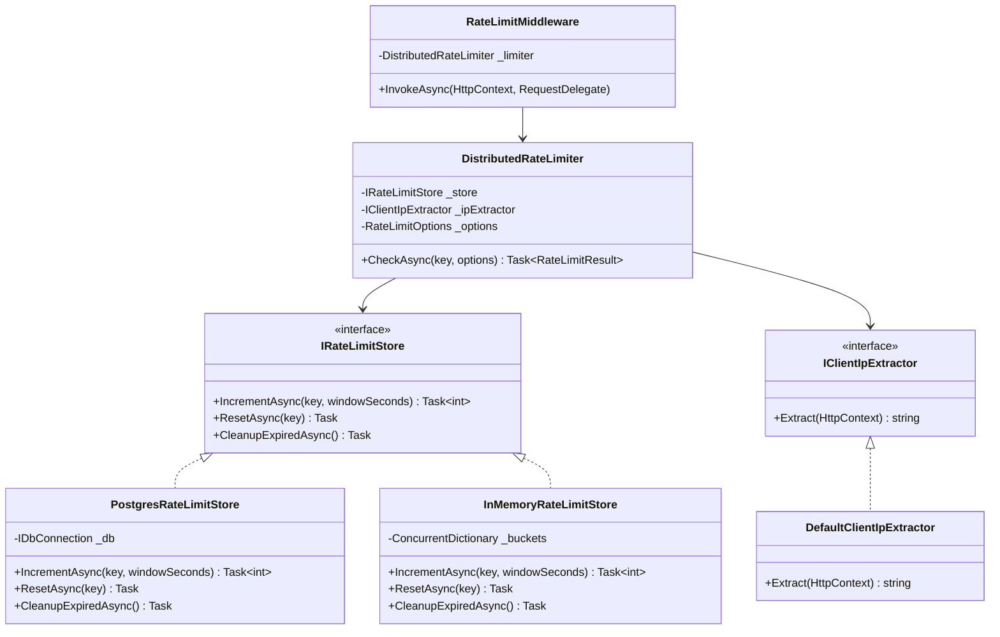
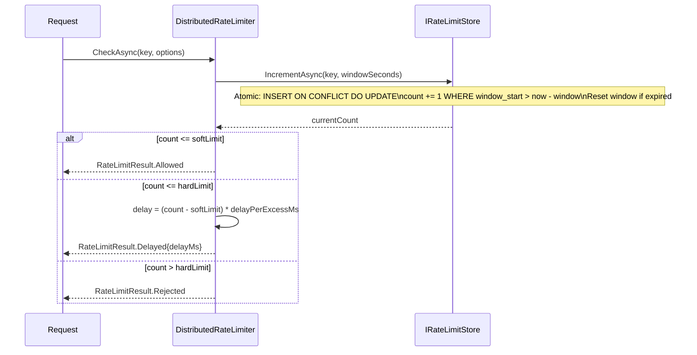
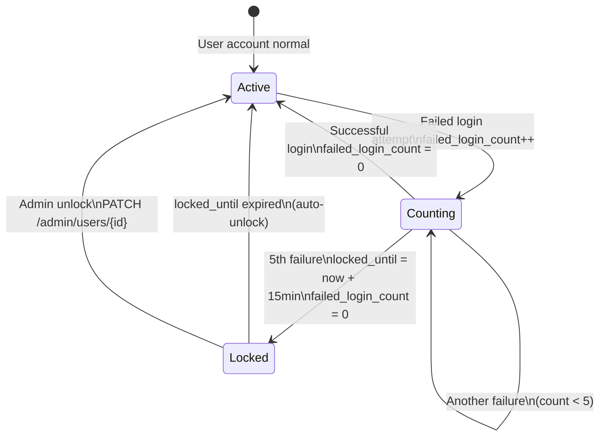

# Spec: GK-RATELIMIT — Distributed Rate Limiting

> Spec IDs: `[GK-RATELIMIT-*]`  
> Parent spec: `gatekeeper-spec.md`

---

## [GK-RATELIMIT] Overview

Distributed rate limiting protects all Gatekeeper endpoints from credential stuffing, brute-force login, and denial-of-service. The implementation is ported from the Gigs codebase and extended with:

- Database independence (`IDbConnection` only — no Npgsql leak)
- Pluggable IP extraction
- Per-account limits (not just per-IP)
- Account lockout on repeated authentication failures
- DataProvider YAML schema integration

---

## [GK-RATELIMIT-ARCH] Architecture



---

## [GK-RATELIMIT-ALGO] Sliding Window Algorithm

The sliding window counter is the chosen algorithm for all auth endpoints. It prevents boundary bursts that fixed-window counters are vulnerable to.



---

## [GK-RATELIMIT-SCHEMA] Database Schema

```yaml
# Added to gatekeeper-schema.yaml
- name: gk_rate_limit
  columns:
    - name: id            type: Text      # bucket key
    - name: request_count type: Int       # counter within window
    - name: window_start  type: DateTime  # start of current window
  primaryKey:
    name: PK_gk_rate_limit
    columns: [id]
  indexes:
    - name: IX_gk_rate_limit_window_start
      columns: [window_start]
```

Bucket key format: `"{endpoint}:{type}:{value}"`, e.g.:
- `"login:ip:203.0.113.42"`
- `"login:account:user-uuid"`
- `"register:ip:203.0.113.42"`

---

## [GK-RATELIMIT-LIMITS] Endpoint Limits

| Endpoint | Bucket type | Soft limit | Hard limit | Window |
|---|---|---|---|---|
| POST /auth/register/begin | per-IP | 5/min | 10/min | 60s |
| POST /auth/register/complete | per-IP | 3/min | 5/min | 60s |
| POST /auth/login/begin | per-IP | 10/min | 20/min | 60s |
| POST /auth/login/complete | per-IP | 3/min | 5/min | 60s |
| POST /auth/login/complete | per-account | 5/15min | 10/hour | 900s |
| POST /auth/supabase/exchange | per-IP | 10/min | 20/min | 60s |
| GET /authz/check | per-IP | 100/min | 200/min | 60s |
| POST /authz/evaluate | per-IP | 50/min | 100/min | 60s |

Soft limit: requests are delayed by `(count - softLimit) × 150ms`.  
Hard limit: request rejected with HTTP 429, `Retry-After: {windowSeconds}` header.

---

## [GK-RATELIMIT-LOCKOUT] Account Lockout

Account lockout is a separate mechanism from rate limiting — it operates at the user level, not per-IP.



Schema additions to `gk_user`:
```yaml
- name: locked_until        type: DateTime   nullable: true
- name: failed_login_count  type: Int        defaultValue: "0"
- name: token_version       type: Int        defaultValue: "0"
```

On `/auth/login/begin`: if `locked_until IS NOT NULL AND locked_until > now`, return 429 immediately with `Retry-After: {seconds_remaining}`.

---

## [GK-RATELIMIT-IP] IP Extraction

`DefaultClientIpExtractor` checks headers in priority order:

```
1. CF-Connecting-IP      (Cloudflare)
2. X-Real-IP            (nginx)
3. X-Forwarded-For      (first non-private IP in list)
4. RemoteIpAddress      (direct connection fallback)
```

Private IP ranges (`10.x`, `172.16-31.x`, `192.168.x`) are skipped when parsing `X-Forwarded-For` to prevent IP spoofing via internal proxies.

---

## [GK-RATELIMIT-RESULT] RateLimitResult

Discriminated union returned by `DistributedRateLimiter.CheckAsync`:

```csharp
public abstract record RateLimitResult
{
    public sealed record Allowed : RateLimitResult;
    public sealed record Delayed(int DelayMs) : RateLimitResult;
    public sealed record Rejected(int RetryAfterSeconds) : RateLimitResult;
}
```

`RateLimitMiddleware` handles each case:
- `Allowed` → call next middleware
- `Delayed` → `await Task.Delay(delayMs)`, then call next middleware
- `Rejected` → return 429 with `Retry-After` header; do NOT call next

---

## [GK-RATELIMIT-GRACEFUL] Graceful Degradation

If `IRateLimitStore.IncrementAsync` throws:
- Log the error at `Warning` level
- Fall through to `Allowed` (fail open)
- Do NOT bubble the exception to the client

This ensures a database hiccup doesn't take down authentication. The `InMemoryRateLimitStore` serves as automatic fallback during failover.

---

## [GK-RATELIMIT-CLEANUP] Cleanup

A background `IHostedService` runs every 60 seconds:
- Calls `IRateLimitStore.CleanupExpiredAsync()`
- Deletes `gk_rate_limit` rows where `window_start < now - 2 * max_window_seconds`
- Logs count of deleted rows at `Debug` level
