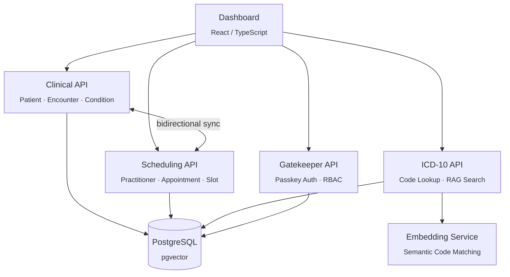

<div align="center">

# Nimblesite Clinical Coding Platform

**Agentic ICD coding powered by patient encounters, clinical notes, and semantic search**

[](https://github.com/MelbourneDeveloper/HealthcareSamples/actions/workflows/ci.yml)
[](https://dotnet.microsoft.com/)
[](https://build.fhir.org/resourcelist.html)
[](LICENSE)

<br />

Built on [**Nimblesite**](https://www.nimblesite.co) [**DataProvider**](https://github.com/MelbourneDeveloper/DataProvider) &mdash; compile-time safe database access, migrations, sync, and query for .NET

</div>

---

> [!CAUTION]
> **Not for production clinical use.** This is a reference implementation and technology demonstration. [Nimblesite](https://www.nimblesite.co) is not responsible for any healthcare decisions, clinical outcomes, or regulatory compliance arising from use of this software. Always validate ICD coding through qualified clinical coders and established healthcare governance processes.

---

## What Is This?

A full-stack healthcare platform where **patient encounters, observations, and clinical notes flow through FHIR-compliant APIs** into an agentic pipeline that determines ICD-10 codes via semantic search and RAG.

The system captures the clinical context needed to support automated coding: structured encounter data, conditions, medications, and free-text notes. The ICD-10 service uses **pgvector embeddings** to semantically match clinical descriptions to the correct codes &mdash; the foundation for an AI-assisted clinical coding workflow.

<table>
<tr>
<td width="50%">

### Clinical Data Pipeline
- FHIR R5 Patient, Encounter, Condition, MedicationRequest
- Bidirectional sync between Clinical and Scheduling
- Structured data for coding context

</td>
<td width="50%">

### Agentic ICD Coding
- Semantic search over 16,000+ ICD-10-AM codes
- pgvector embeddings for clinical text matching
- RAG pipeline for code determination from notes
- ACHI procedure code support

</td>
</tr>
</table>

## Quick Start

**Prerequisites:** [Docker](https://docs.docker.com/get-docker/), [.NET 10 SDK](https://dotnet.microsoft.com/download), [GNU Make](https://www.gnu.org/software/make/)

```bash
make start-docker
```

That's it. Starts Postgres, migrates schemas, boots all APIs, and serves the dashboard.

Open **http://localhost:5173**

<details>
<summary><b>Other ways to run</b></summary>

```bash
# Force-rebuild containers
make start-docker BUILD=1

# Run APIs locally (faster rebuild cycle, Postgres still in Docker)
make start-local

# Ctrl+C stops everything
```

</details>

## Services

| Service | Port | Role |
|:--------|:-----|:-----|
| **Dashboard** | [localhost:5173](http://localhost:5173) | React UI &mdash; patient management, sync monitoring, code search |
| **Clinical API** | [localhost:5080](http://localhost:5080) | Patient, Encounter, Condition, MedicationRequest |
| **Scheduling API** | [localhost:5001](http://localhost:5001) | Practitioner, Appointment, Schedule, Slot |
| **ICD-10 API** | [localhost:5090](http://localhost:5090) | ICD-10/ACHI codes, semantic search, RAG coding |
| **Gatekeeper API** | [localhost:5002](http://localhost:5002) | Passkey authentication, RBAC authorization |
| **Postgres** | localhost:5432 | pgvector-enabled, 4 databases |

## Architecture



**Clinical** and **Scheduling** sync data bidirectionally &mdash; practitioners flow into Clinical, patients flow into Scheduling. The **ICD-10 API** provides semantic search over medical codes, forming the backbone of the coding pipeline.

## Data Ownership

| Domain | Owns | Receives via Sync |
|:-------|:-----|:------------------|
| Clinical | fhir_Patient, fhir_Encounter, fhir_Condition, fhir_MedicationRequest | sync_Provider |
| Scheduling | fhir_Practitioner, fhir_Appointment, fhir_Schedule, fhir_Slot | sync_ScheduledPatient |
| ICD-10 | icd10_chapter, icd10_block, icd10_category, icd10_code, achi_block, achi_code | &mdash; (read-only reference) |

## Development

```bash
make ci             # full CI: lint + test + build
make test           # run all tests (fails on coverage threshold violations)
make lint           # run all linters
make fmt            # format all code
make build          # compile everything (Release)
make clean          # remove build artifacts
make setup          # restore tools + packages (run once after clone)
```

<details>
<summary><b>Database targets</b></summary>

```bash
make db-up          # start Postgres container
make db-down        # stop Postgres container
make db-migrate     # apply schemas to all databases
make db-reset       # wipe and recreate databases from scratch
```

</details>

## API Reference

<details>
<summary><b>Clinical API</b> &mdash; <code>:5080</code></summary>

| Method | Endpoint | Description |
|:-------|:---------|:------------|
| GET/POST | `/fhir/Patient` | Patients |
| GET | `/fhir/Patient/_search?q=smith` | Search patients |
| GET/POST | `/fhir/Patient/{id}/Encounter` | Encounters |
| GET/POST | `/fhir/Patient/{id}/Condition` | Conditions |
| GET/POST | `/fhir/Patient/{id}/MedicationRequest` | Medications |
| GET | `/sync/changes?fromVersion=0` | Sync feed |

</details>

<details>
<summary><b>Scheduling API</b> &mdash; <code>:5001</code></summary>

| Method | Endpoint | Description |
|:-------|:---------|:------------|
| GET/POST | `/Practitioner` | Practitioners |
| GET | `/Practitioner/_search?specialty=cardiology` | Search |
| GET/POST | `/Appointment` | Appointments |
| PATCH | `/Appointment/{id}/status` | Update status |
| GET | `/sync/changes?fromVersion=0` | Sync feed |

</details>

<details>
<summary><b>ICD-10 API</b> &mdash; <code>:5090</code></summary>

| Method | Endpoint | Description |
|:-------|:---------|:------------|
| GET | `/api/icd10/chapters` | ICD-10 chapters |
| GET | `/api/icd10/chapters/{id}/blocks` | Blocks within chapter |
| GET | `/api/icd10/codes/{code}` | Code lookup (`?format=fhir`) |
| GET | `/api/icd10/codes?q={query}&limit=20` | Text search |
| GET | `/api/achi/blocks` | ACHI procedure blocks |
| GET | `/api/achi/codes?q={query}&limit=20` | ACHI text search |
| POST | `/api/search` | RAG semantic search |

</details>

<details>
<summary><b>Gatekeeper API</b> &mdash; <code>:5002</code></summary>

| Method | Endpoint | Description |
|:-------|:---------|:------------|
| POST | `/auth/register/begin` | Start passkey registration |
| POST | `/auth/register/complete` | Complete passkey registration |
| POST | `/auth/login/begin` | Start passkey login |
| POST | `/auth/login/complete` | Complete passkey login |
| GET | `/auth/session` | Current session info |
| GET | `/authz/check` | Permission check |
| POST | `/authz/evaluate` | Bulk permission evaluation |

</details>

## Tech Stack

| Layer | Technology |
|:------|:-----------|
| Runtime | .NET 10, ASP.NET Core Minimal API |
| Database | PostgreSQL + pgvector |
| Data Access | [Nimblesite](https://www.nimblesite.co) [DataProvider](https://github.com/MelbourneDeveloper/DataProvider) (compile-time safe SQL) |
| Sync | [Nimblesite](https://www.nimblesite.co) Sync Framework (bidirectional) |
| Query | [Nimblesite](https://www.nimblesite.co) LQL (Lambda Query Language) |
| Embeddings | MedEmbed via FastAPI |
| Frontend | TypeScript + React + Vite |
| Infrastructure | Docker Compose |

## License

MIT
